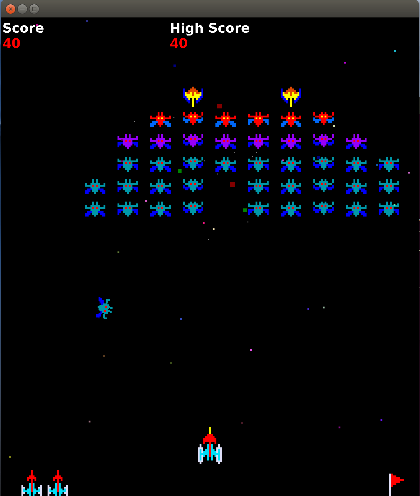

# JGalaxian



JGalaxian is a Java-based Galaxian clone (you do remember Galaxian, right?). Although it's a pretty fun game in its own right, the code also serves as a decent tutorial on one way of building 2D games in general and in Java in particular. Some features of the design:

1. Scalable
1. 2D sprites
1. Sprite lists
1. Collision detection
1. Game state machine

Standard stuff, really, but if you're new to 2D game design, maybe you'll find something useful to copy to use in your own games.

# Compiling JGalaxian

## Java

I use OpenJDK 8, so I know for sure it will work with that. To install it in Ubuntu:

```
sudo apt install openjdk-8-jdk
```

You can also use Oracle Java 8:

```
sudo apt-get install python-software-properties
sudo add-apt-repository ppa:webupd8team/java
sudo apt-get update
sudo apt-get install oracle-java8-installer
```

## Apache Maven

First, install Apache Maven. To install it in Ubuntu:

```
sudo apt install maven
```

## Compiling

```
mvn package
```

# Running it

```
./jg
```

# Scaling game screen

If you're running JGalaxian on a HiDPI screen, you likely now have a headache from squinting at the tiny screen. Open up `JGGlob.java` in your favorite text editor and change:

```
public static final double                  SCALE=1.0;
```

to

```
public static final double                  SCALE=3.0;
```

or whatever size works for your setup.

Recompile and run.

